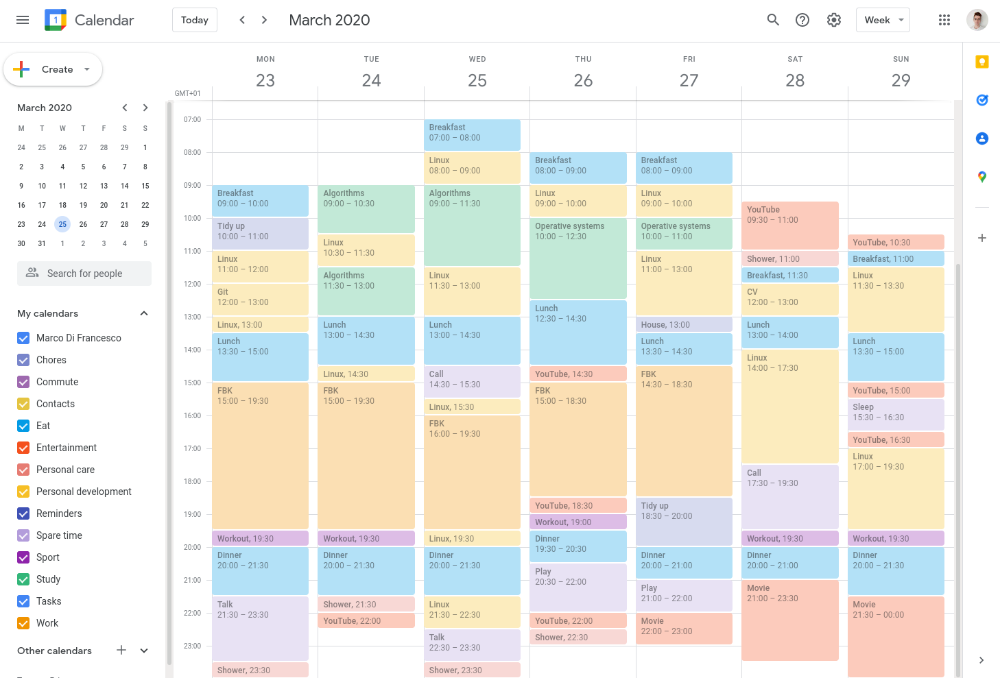

# Calendar Analyzer
My life, visualized.

## Data collection
Done using Google Calendar

    

## Dashboard
Hosted in a 1GB Raspberry Pi inside a Docker container, be kind with it ❤️

[
    
    
    
](http://raspberry.gleeze.com:8501/)
