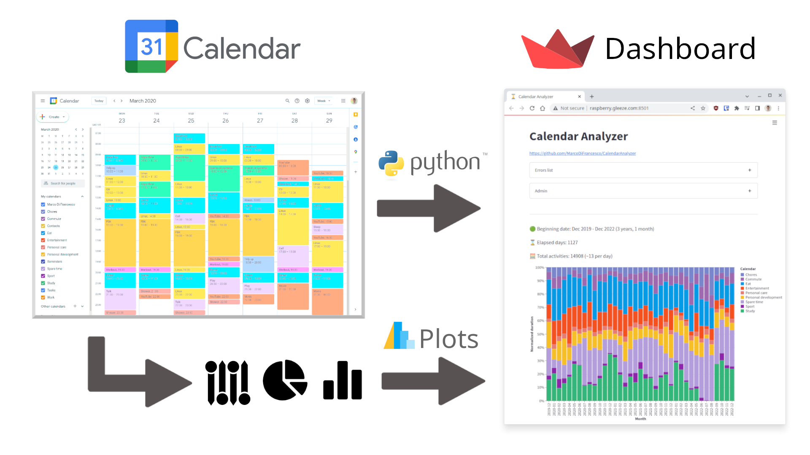
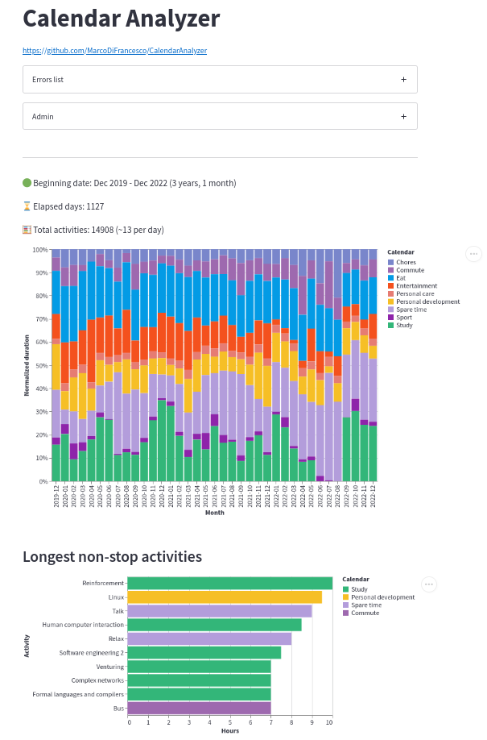
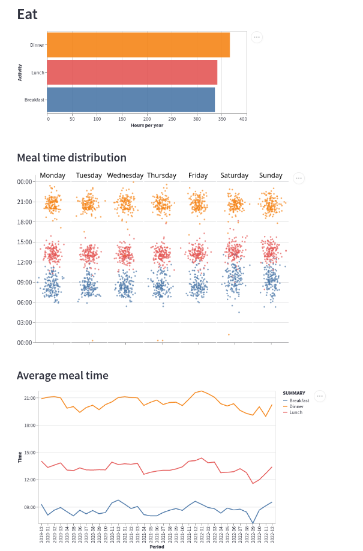
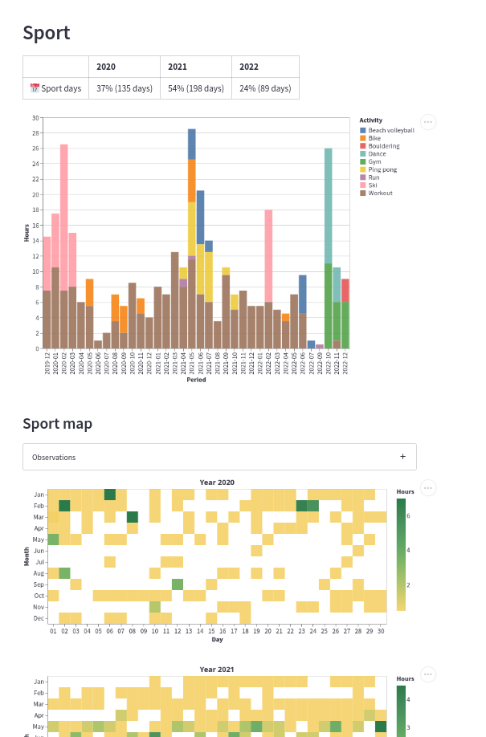

<h1 align="center">Welcome to Calendar Analyzer 👋</h1>

> My Life, Visualized.

Visualize **Google Calendar** events in an **Interactive Dashboard**.

Includes **3 years** of data, collected every **30 minutes**.

<p align="center">
<!-- <kbd> -->

<!-- </kbd> -->
</p>

<!--  -->

## [👁️ Preview](http://raspberry.gleeze.com:8501)

[Preview](http://raspberry.gleeze.com:8501) hosted in a 1GB Raspberry Pi, be kind to it ❤️

_(alternative on streamlit cloud - [link](https://marcodifrancesco-calendaranalyzer-app-4f17ot.streamlit.app/))_

<p align="center">
<kbd></kbd>
<!-- <kbd></kbd> -->
<kbd></kbd>
<!-- <kbd></kbd> -->
<!-- <kbd></kbd> -->
<kbd></kbd>
</p>

<p align="center">
</p>

## 🚀 Usage

Run with 3 years of sample data provided.

Prerequisites: **Python 3.10**

1. Clone repository

```
git clone https://github.com/MarcoDiFrancesco/CalendarAnalyzer.git
cd CalendarAnalyzer
```

2. (Optional) Create Virtual Environment

```sh
python3.10 -m venv .venv
source .venv/bin/activate
```

3. Install Python packages

```sh
pip install wheel
pip install -r requirements.txt
```

4. Source environment variables (e.g. calendar links)

```sh
source .envvars.sample
```

5. Run Dashboard

```sh
streamlit run app.py
```

6. Now open the Dashboard → `http://localhost:8501`

## FAQ

🚉 _Which platform you collect data with?_ Google Calendar.

⬇️ _How do you download data from Google Calendar?_ Instructions in the Wiki page [Get calendar link](https://github.com/MarcoDiFrancesco/CalendarAnalyzer/wiki/Get-calendar-link).

📜 _Which categories do you use?_ Structure of these calendars (e.g. Study, Sport) can be found in the Wiki page [Categorization](https://github.com/MarcoDiFrancesco/CalendarAnalyzer/wiki/Categories).

❓ _Why these categories?_ Can be found in Wiki page [Categorization rules](https://github.com/MarcoDiFrancesco/CalendarAnalyzer/wiki/Categorization-rules).

🖼️ _How does code structure looks like?_ Nobody wants to know, but still looks amazing, just look Wiki page [Extra](https://github.com/MarcoDiFrancesco/CalendarAnalyzer/wiki/Extra).
